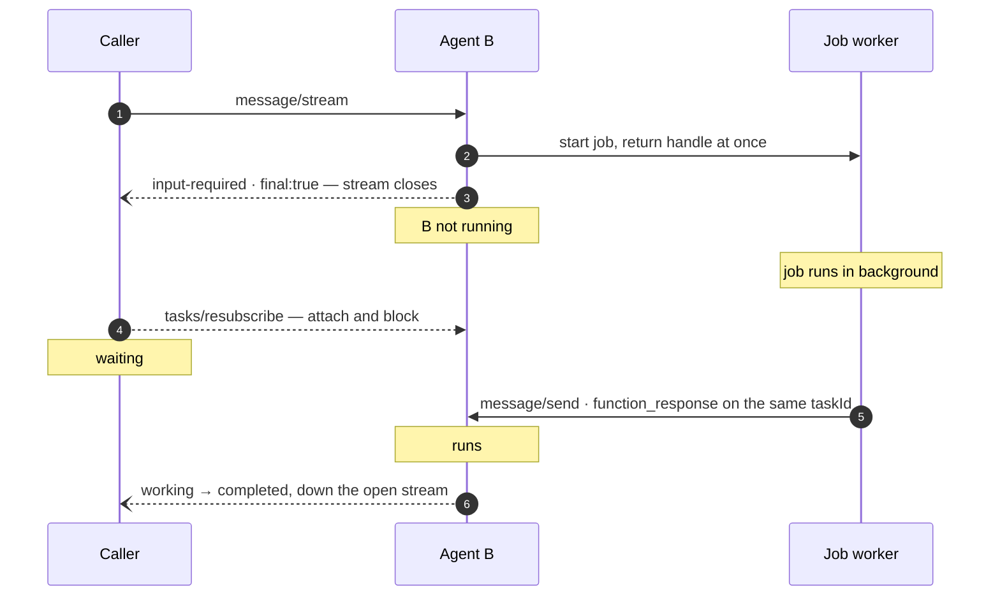

# How an A2A task pauses, and who wakes it up

A2A has no bidirectional call channel. Everything about long-running work, human
approval and "tell me when it's done" is built out of four smaller parts — a
stream, a task store, an event queue and a push-notification store — and out of
one fact that surprises people: **a paused agent is not running.**

Every claim marked **[verified]** below was exercised against the two agents in
this repository, running as separate A2A services on localhost. The rest is read
from the source of `google-adk` 2.8.0 and `a2a-sdk` 1.1.2.

> A styled version of this document is in [`a2a-task-mechanics.html`](./a2a-task-mechanics.html).

**Contents**

1. [The shape of the protocol](#1-the-shape-of-the-protocol)
2. [Methods and transports](#2-methods-and-transports)
3. [The task is the unit of state](#3-the-task-is-the-unit-of-state)
4. [The four moving parts](#4-the-four-moving-parts)
5. [How a long-running tool parks a task](#5-how-a-long-running-tool-parks-a-task)
6. [Nobody is watching](#6-nobody-is-watching)
7. [Three ways to learn it moved](#7-three-ways-to-learn-it-moved)
8. [Wiring a hands-off chain](#8-wiring-a-hands-off-chain)
9. [What breaks at scale](#9-what-breaks-at-scale)

---

## 1. The shape of the protocol

A2A is ordinary HTTP. One side sends a request, the other answers. There is no
socket, no persistent duplex channel, no way for a server to call a method on a
client. Every A2A method in the spec is invoked *client → server*.

So when people say A2A is "bidirectional", they mean **data flows both ways**,
not that *calls* do. The asymmetry matters enormously once work outlives a
request, because it determines who has to be a server for the news to travel.

```
CALLS ─── one direction only, except ③

  ┌───────────────┐   every method call — A always initiates   ┌───────────────┐
  │   Agent A     │ ──────────────────────────────────────────►│   Agent B     │
  │   A2A client  │                                            │   A2A server  │
  │  (and a       │ ◄──────────────────────────────────────────│               │
  │   server,     │   ① SSE frames, inside that same response  │               │
  │   for ③)      │                                            │               │
  │               │ ─ ─ ─ ─ ─ ─ ─ ─ ─ ─ ─ ─ ─ ─ ─ ─ ─ ─ ─ ─ ─ ►│               │
  │               │   ② tasks/resubscribe — A re-opens later   │               │
  │               │                                            │               │
  │               │ ◄══════════════════════════════════════════│               │
  └───────────────┘   ③ webhook POST — the only call B makes   └───────────────┘
```

Three return channels, one of which inverts the roles. ③ is the only mechanism
where B opens a connection to A — which means **A must itself be reachable as a
server** for push notifications to be an option at all.

---

## 2. Methods and transports

The endpoint ADK mounts answers **both JSON-RPC generations on one URL**
**[verified]**. The 0.3 method names go through a compatibility adapter; the 1.x
proto-JSON names hit the handler directly. Payload shapes differ — 0.3 uses
`"role": "user"` and `kind` discriminators, 1.x uses `"role": "ROLE_USER"` and
proto enums — and sending one generation's shape to the other's method name is an
`Invalid Request`.

| 0.3 name | 1.x name | Response | What it is for |
|---|---|---|---|
| `message/send` | `SendMessage` | JSON | Blocks until the task reaches a stable state; returns the whole Task. |
| `message/stream` | `SendStreamingMessage` | SSE | Same work, delivered as it happens. |
| `tasks/get` | `GetTask` | JSON | Read current state and history from the task store. |
| `tasks/cancel` | `CancelTask` | JSON | Request cancellation. |
| `tasks/resubscribe` | `SubscribeToTask` | SSE | Re-attach a stream to a task already in flight. |
| `tasks/pushNotificationConfig/set` | `CreateTaskPushNotificationConfig` | JSON | Register a webhook for this task. |
| `…/get` · `…/list` · `…/delete` | `Get…` · `List…` · `Delete…` | JSON | Manage those registrations. |

Discovery is a plain `GET` of the Agent Card at
`/.well-known/agent-card.json`. The card is not documentation — it is
**enforced**. Push-notification methods are rejected outright unless the card
declares `capabilities.pushNotifications: true` **[verified]**, and ADK's client
validates that a card's RPC URLs are HTTPS (or loopback HTTP) and same-origin
with where the card was fetched.

---

## 3. The task is the unit of state

A *message* is transient. A **task** is the durable thing: an id, a context id, a
status, a message history and any artifacts. Everything long-running hangs off
it.

| State | Terminal | Meaning |
|---|---|---|
| `submitted` | no | Accepted, agent not started. |
| `working` | no | Agent running. Every intermediate event streams under this. |
| `input-required` | no | Agent stopped and needs something from the caller. |
| `auth-required` | no | Same, specifically for credentials. |
| `completed` | **yes** | Finished. Accepts no further input, ever. |
| `failed` / `rejected` | **yes** | Errored or refused. |
| `canceled` | **yes** | Cancelled. |

Two properties do most of the work in a multi-agent system.

First, **terminal means terminal** — a completed task rejects any later message
with `Task … is in terminal state` **[verified]**.

Second, **a task never crosses a hop**. If A calls B, A's caller created task α
on A, and A's client created a separate task β on B. Two ids, two stores, two
lifecycles, correlated only by metadata the middle agent stamps on its events.

---

## 4. The four moving parts

These are separate components with separate lifetimes, and confusing them is the
source of most "why didn't my agent get notified" bugs. Each answers a different
question.

| Part | Answers | What it is |
|---|---|---|
| **SSE stream** | *What is happening right now?* | The response body of `message/stream`. Frames arrive as they are produced. Ends when a frame carries `final: true`. Scoped to one HTTP connection — drop it and you have lost the live view, though not the work. |
| **Task store** | *What is true?* | The durable record: status, full message history, artifacts. What `tasks/get` reads. Defaults to in-memory; `DatabaseTaskStore` makes it survive a restart, wired via `task_store_uri`. |
| **Queue manager** | *Who else is listening?* | An in-memory event queue per live task, fanned out to every attached consumer. Rarely discussed and easy to miss — but it is the entire reason `tasks/resubscribe` can work. |
| **Push config store + sender** | *Where do I shout when this changes?* | The store holds registered webhook URLs. The *sender* is a separate object that actually POSTs to them. Two pieces — and you need both. |

### Verified gap in ADK 2.8.0

ADK constructs the request handler with a `push_config_store` but **never passes
a `push_sender`** — the string `PushNotificationSender` does not appear anywhere
in the `google.adk` package.

The observable result: with `pushNotifications: true` on the card,
`tasks/pushNotificationConfig/set` succeeds and the config reads back from
`…/get` — and **zero webhook deliveries ever arrive** **[verified]**.

Registration succeeding is not evidence that delivery works. Test the webhook,
not the registration.

---

## 5. How a long-running tool parks a task

There is no separate HITL protocol, and no "long-running" message type. There is
one rule, applied in ADK's A2A executor when the agent run ends:

```python
# google/adk/a2a/executor/a2a_agent_executor_impl.py
# after the ADK run finishes
if error_event:                                    final = error_event
elif long_running_functions.has_long_running_function_calls():
                                                   final = <input-required>
else:                                              final = <completed>
```

That is the whole mechanism. A tool marked `LongRunningFunctionTool` returns a
pending value; ADK records its call id in `long_running_tool_ids`; the executor
sees an unanswered long-running call and ends the task `input-required` instead
of `completed`. Human approval and background jobs are the same mechanism
wearing different clothes.

The pending call travels outward as a **DataPart**, not as prose. This is the
contract a caller has to read:

```jsonc
// ← final SSE frame: status-update, state input-required
{
  "kind": "status-update",
  "taskId": "97a9ce53-…",
  "status": {
    "state": "input-required",
    "message": { "role": "agent", "parts": [ {
      "kind": "data",
      "data": { "id": "fc-1a5cd0aca320",
                "name": "request_change_approval",
                "args": { "service": "checkout-api", "risk": "high" } },
      "metadata": { "adk_type": "function_call",
                    "adk_is_long_running": true }
    } ] }
  }
}
```

Resuming means answering that exact call id, on that exact task:

```jsonc
// → message/stream: the resume
{ "message": {
    "role": "user",
    "taskId": "97a9ce53-…",              // same task, or you start a new one
    "parts": [ {
      "kind": "data",
      "data": { "id": "fc-1a5cd0aca320",   // same call id
                "name": "request_change_approval",
                "response": { "approved": true, "decided_by": "papu" } },
      "metadata": { "adk_type": "function_response" }
    } ] } }
```

### The trap

Replying to a parked task with ordinary text does *not* error and does *not*
resume the gate. ADK simply runs the agent again with that text as input; no new
long-running call is issued, so the task reaches `completed` with the approval
never recorded — and the correct function response afterwards is refused because
the task is now terminal **[verified]**.

It looks like it worked: a message went in, the agent replied, the task went
green. Nothing was approved.

`python scripts/a2a_probe.py wrong-resume` demonstrates it;
`tests/test_a2a_protocol.py` pins it.

---

## 6. Nobody is watching

Here is the part that answers "how does the second agent tell the first when it's
done", and it is not a protocol feature — it is an absence.

> **The load-bearing fact.** When a task parks in `input-required`, the agent run
> has **ended**. The generator is closed, the coroutine is gone. There is no
> thread inside agent B watching the deployment job, no timer, no callback
> registered anywhere. From B's point of view *nothing is happening*.

So "the second agent notifies the first when it's done" cannot work the way the
phrasing suggests. B is not going to notice completion, because B is not
executing. Push notifications don't help either: a webhook fires on a *task state
change*, and a parked task has no state change to report until somebody causes
one.

Which reframes the problem correctly. There are two independent questions, and
they need two different answers:

1. **Who moves the task off `input-required`?** Whatever is actually doing the
   work must call back in. Nothing else can.
2. **How does the caller find out it moved?** That is where streaming,
   resubscribe and webhooks come in.

The answer to (1) is the **worker-as-A2A-client** pattern: the background job
holds the task id, the context id and the pending call id, and on completion it
POSTs a function response to the *same agent's own A2A endpoint*. The agent that
parked the task is woken by an ordinary inbound A2A call, exactly as if a human
had answered — no privileged path, no framework support required.



The completion travels **inward**, not outward. The worker wakes agent B with an
ordinary A2A call; only then does B have news, and the caller — already
re-attached — receives it with no polling and no human.

Verified end to end: a watcher that sent nothing received every event produced by
a separate connection's resume.

---

## 7. Three ways to learn it moved

Given something *will* move the task, the caller has three options. They are not
interchangeable.

| Mechanism | Caller must be | Survives | Cost |
|---|---|---|---|
| **Hold the stream**<br>the original `message/stream` | A client | Nothing — it already closed when the task parked | Free, but unavailable: `final: true` ended it |
| **Re-attach**<br>`tasks/resubscribe` | A client | Client restarts, network blips | One held connection per waiting task; dies if the *server* restarts |
| **Webhook**<br>`pushNotificationConfig/set` | **A server** | Both sides restarting, arbitrary delays | Needs a reachable HTTPS endpoint, auth, and SSRF protection |

### What resubscribe actually does

It yields the current `Task` as its first frame, then attaches an `EventConsumer`
to the task's live queue and streams everything subsequently produced — *by
anyone*. That last part is the useful bit: the party who resumes a task and the
party who watches it need not be the same process.

```
WATCHER  tasks/resubscribe  →  task, state=input-required
                               : ping … : ping …          ← keep-alive, holding
RESUMER  (different connection) message/stream, function_response
WATCHER                     →  status-update  working
WATCHER                     →  status-update  working
WATCHER                     →  status-update  input-required   ← next gate
```

Two limits are worth knowing before you build on it.

Resubscribe raises `UnsupportedOperationError` on a task already in a terminal
state — so a completion that lands during your reconnect window is missed, and
you must fall back to `tasks/get`.

And it depends on the in-memory queue, which the SDK's own docstring says
*"requires all incoming interactions for a given task ID to hit the same binary
instance."* It survived a 20-second gap in testing **[verified]**, but it will
not survive a process restart or a load balancer sending the next request
elsewhere.

---

## 8. Wiring a hands-off chain

Putting it together, here is what a genuinely unattended long-running hand-off
needs. Some of it ADK gives you; some of it is yours to write, and it is worth
being clear about which.

| Piece | Who provides it |
|---|---|
| Task parks on an unanswered long-running call | ADK, automatically |
| Pending call travels outward as a tagged DataPart | ADK, automatically |
| Pause mirrors outward across each additional hop | ADK, automatically — the same rule reapplied per hop |
| Worker knows its task id, context id and call id | **You.** `ToolContext.function_call_id` gives the call id; the task id needs an `ExecuteInterceptor` or a custom request converter |
| Worker calls back into the agent's own A2A endpoint | **You.** A few lines of HTTP in the job's completion path |
| Webhooks actually delivered | **You.** Attach a `BasePushNotificationSender`; ADK wires none |
| Card declares `pushNotifications: true` | **You.** Without it the methods are rejected |
| An outer agent subscribes to its downstream task | **You.** `RemoteA2aAgent` neither registers a push config nor resubscribes |

That last row is the honest limit today. ADK's client happily surfaces a
downstream pause to its own caller, but it does not watch the downstream task
afterwards. So in a two-hop chain, the bridge that notices β finished and answers
α is a component you write — an inbound webhook route, or a resubscribe loop —
sitting beside the agent rather than inside it.

**This repository does not yet implement that bridge.** `scripts/demo_client.py`
and `scripts/a2a_chain_probe.py` poll `/ops/jobs/{id}` and post the function
response themselves, which stands in for the worker callback and the subscriber
in one place. That is deliberate — it keeps the long-running contract visible —
but it is a poller, not the autonomous design described above.

> **Design rule that falls out of all this.** Anything a downstream agent wants
> an eventual caller to act on must be **data in a tool result** — a job id, a
> poll URL, a ticket number — never state held in a connection. Handles are
> portable across hops and restarts; streams are not. A caller three hops away
> can act on a job id it was handed. It can do nothing at all with a socket that
> closed.

---

## 9. What breaks at scale

- **Sticky routing is mandatory for streaming.** The queue manager is
  per-process. Two replicas behind a round-robin load balancer will resubscribe
  to the wrong instance and get `TaskNotFound`. Route by task id, or accept that
  only `tasks/get` and webhooks work.
- **Default stores lose everything on restart.** Tasks, push configs and sessions
  are all in-memory unless you point `task_store_uri` and `session_service_uri`
  at real storage. A parked approval that vanishes on deploy is a silent
  data-loss bug wearing a restart's clothes.
- **Webhook URLs are an SSRF vector.** They arrive in a request body from a
  caller. Validate against a registry; never POST to whatever you were handed.
- **Tokens outlive nothing; tasks outlive everything.** A task parked for a day
  and resumed with a credential minted yesterday is a decision you have to make
  deliberately. A2A declares `securitySchemes` on the card but implements no auth
  and defines no authorization model — entitlement is entirely yours, and it has
  to be pinned before the planner runs, since an agent often discovers which
  tools it needs only after accepting the task.
- **Cancellation is a request, not a guarantee.** `tasks/cancel` asks. Whether
  the background job the tool started actually stops is between you and your
  queue.

---

*Verified against two ADK agents running as separate A2A services on localhost —
`google-adk 2.8.0`, `a2a-sdk 1.1.2`, Python 3.11. ADK's A2A surface carries
`@a2a_experimental`; pin it, and expect the executor internals cited here to move
between minors.*
